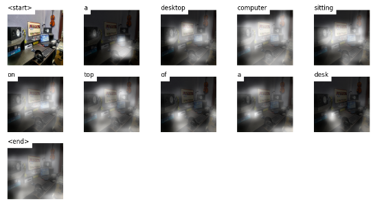

# **Image Captioning**
> This repo is based on [show, attend and tell](https://arxiv.org/pdf/1502.03044.pdf) paper and [Github repository](https://github.com/sgrvinod/a-PyTorch-Tutorial-to-Image-Captioning) implementation.

## **Table of Content**
  - [Introduction](#introduction)
  - [Prediction Result](#prediction-result)
  - [Conclusion](#conclusion)
  - [Instruction For Running](#instruction-for-running)
  - [References](#references)

## Introduction
- Image captioning is a multi-modal technique that makes use of both **convolutional neural networks** (CNN) and **Recurrent neural networks** (RNN).
- Basically,
    - **CNN** model is used to extract features from a given image.
    - **RNN** model translates features generated by CNN into descriptive captions.
- In any machine learning task, Using available datasets we will build a model and use it for prediction in real world data.
- **Available Image Captioning Datasets:**
    - **Flickr 8k:**
        - It contains 8000 images and each image with 5 captions provided by human annotators.
        - Total images is divided into **training_set**, **development_set**, **test_set:**
            - **Training_set** = 6000 images
            - **Development_set** = 1000 images
            - **Test_set** = 1000 images 
        - **Data source:** [Flickr_8k](https://www.kaggle.com/aladdinpersson/flickr8kimagescaptions)
    - **Flickr_30k:**
        - The **Flickr30k** dataset contains 30, 000 images collected from flickr, together with 5 references provided by human annotators.
        - **Data source:** [Flickr_30k](https://www.kaggle.com/hsankesara/flickr-image-dataset)
    - **Ms Coco:**
        - **COCO** is a large scale **object detection**, **segmentation**, and **captioning dataset**
        - For **image captioning**, MS Coco dataset contains over 82,000 images, each of which has atleast 5 different human annotated captions.
    - About **COCO Dataset:** [click_here](https://cocodataset.org/#home)
    - **Download links:**
        - [Download images](http://images.cocodataset.org/zips/train2014.zi)
        - [Download annotations](http://images.cocodataset.org/annotations/annotations_trainval2014.zip)
- **Reference Paper:**
    - [show, attend and tell](https://arxiv.org/abs/1502.03044)

## Prediction Result
- **Using Flickr 8k datasets without using attention mechanism:**
    - 
- **Using Flickr_8k datasets with attention mechanism:**
    - 
    - 
    - 
    - 
    - 
- **Using Ms Coco datasets using attention mechanism:**
    - 
    - 
    - 
    - 
    -  

## Conclusion
- As we have discussed several available open source datasets for image captioning. 
- Some dataset are small and some dataset are very very big.
- If we have large diverse datasets, then it helps our model to better generalize the real world data.
- As we have seen in the above prediction result, results are better using the model trained on the **coco dataset** compared to the **flickr_8k dataset**
- Also, from the paper [show, attend, and tell](https://arxiv.org/abs/1502.03044) we can see BLEU score increases when the size of data is increased:
    - 
    - We can think of **BLEU** score as an evaluation metric for evaluating our image caption result. Higher **BLEU** score means better image caption model.
    - So from the above table we can see that BLEU score is higher for **COCO dataset** than **Flickr30k** and **Flickr8k** dataset.
- However as the size of the dataset increases we need high computation power in training the model and it may take days of training in GPU.
- As **COCO dataset** is a huge dataset i.e. **13GB train** and **6GB Validation** so training on such dataset needs high computation and days for completion. Also **hyperparameter tuning** is also challenging.

## Instruction For Running
- For training and evaluating models you need:
    - An HDF5 file containing images.
    - A json file which contains the `word_map`, the word-to-index dictionary.
    - **word_map.json screenshot**
        - 
- **Steps creating data files (using flickr_8k datasets):**
    - Download [Flickr_8k](https://www.kaggle.com/aladdinpersson/flickr8kimagescaptions)
    - Download [dataset_flickr8k.json](https://www.kaggle.com/shtvkumar/karpathy-splits)
    - Navigate to `create_input_files.py` and **set:**
        - dataset = "`flickr8k`"
        - karpathy_json_path = "`/path_to_downloaded_karpthy_json_file/dataset_flickr8k.json`"
        -  captions_per_image = `5`
        - min_word_freq = `5`
        - output_folder = "`/path_to_save_generated_hdf5_json_wordmap_file/folder_name`"
        - max_len = `50`
    - Run command to create data files: `python create_input_files.py`
    - **Screenshot of generated files:**
        - 
- **Steps for training:**
    - Navigate to `train.py` and **set path for**:
        - data_folder = "`path_to_the_folder with data files saved by create_input_files.py`"
        - data_name =  "`base_name_shared_by_saved_data_files`
"
            - Example for flickr8k data: "`flickr8k_5_cap_per_img_5_min_word_freq`"
    - `Change Model parameters if you wish (Optional)`
    - Run Command: `python train.py`
    - **Training Screenshot:**
        - 
- **Steps for Inference:**
    - > python caption.py --img="path_to_testImage.jpeg" --model="path/to/BEST_checkpoint_coco_5_cap_per_img_5_min_word_freq.pth.tar" --wordmap="path/to/WORDMAP_coco_5_cap_per_img_5_min_word_freq.json" --beam_size=5
    - **Example:**
        - python caption.py --img='test_examples/anish.jpg' --model='BEST_checkpoint_flickr8k_5_cap_per_img_5_min_word_freq.pth.tar' --word_map='WORDMAP_flickr8k_5_cap_per_img_5_min_word_freq.json' --beam_size=3

## References:
- https://arxiv.org/pdf/1502.03044.pdf
- https://github.com/sgrvinod/a-PyTorch-Tutorial-to-Image-Captioning
- https://github.com/aladdinpersson/Machine-Learning-Collection/tree/master/ML/Pytorch/more_advanced/image_captioning
